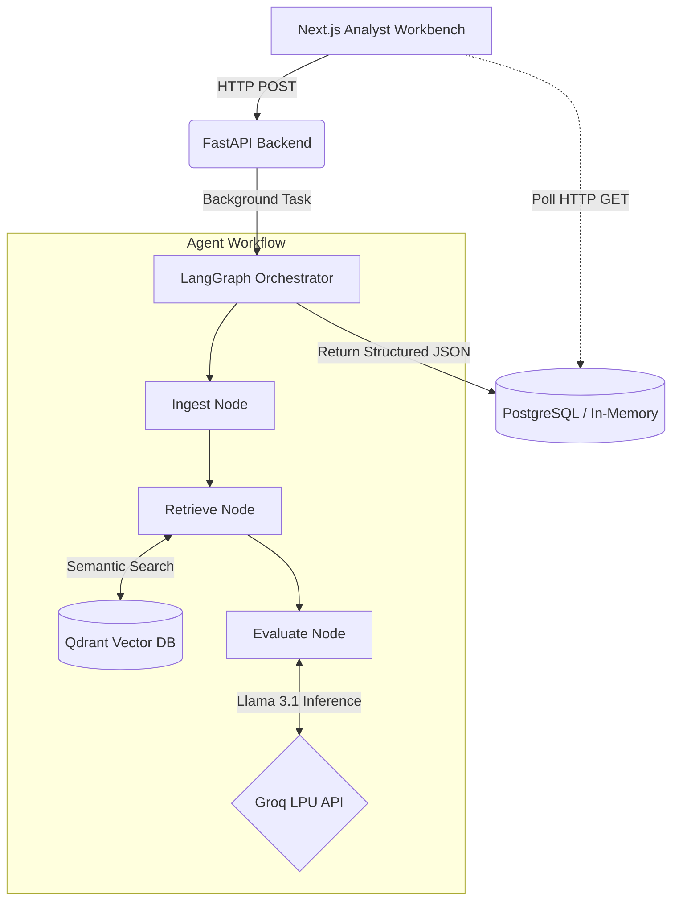

<div align="center">
  
  <h1 align="center">ClaimPilot AI</h1>

  <p align="center">
    <strong>Advanced Multi-Agent Revenue Cycle Intelligence Platform</strong>
    <br />
    A LangGraph-orchestrated system that leverages Llama-3.1 via Groq and Qdrant Vector Search to autonomously adjudicate medical claims with unparalleled speed and accuracy.
    <br />
    <br />
    <a href="#features">Features</a>
    ·
    <a href="#architecture">Architecture</a>
    ·
    <a href="#tech-stack">Tech Stack</a>
    ·
    <a href="#quickstart">Quickstart</a>
  </p>
</div>

<div align="center">
  
  [](https://fastapi.tiangolo.com/)
  [](https://nextjs.org/)
  [](https://langchain.com/)
  [](https://groq.com/)
  [](https://qdrant.tech/)

</div>

<hr />

## 🚀 Features

- **Multi-Agent Adjudication**: Leverages a stateful LangGraph workflow to perform complex medical claim evaluation.
- **RAG-Powered Intelligence**: Grounds decisions in real clinical policies retrieved via high-speed Qdrant vector search.
- **High-Velocity Inference**: Uses `llama-3.1-8b-instant` served on Groq's LPU architecture for sub-second agent reasoning.
- **Glassmorphic Analyst Workbench**: A premium Next.js frontend featuring fluid animations, KPI trackers, and real-time execution trace viewers.
- **Asynchronous Orchestration**: Background task processing ensuring non-blocking API endpoints.
- **Enterprise Observability**: Native integration with LangSmith for deep multi-agent workflow tracing and token accounting.

## 🧠 Architecture

ClaimPilot AI utilizes a directed cyclic graph (LangGraph) to process incoming medical claims. The orchestration ensures deterministic routing, evidence retrieval, and structured JSON outputs with strict confidence scoring guardrails.



## 💻 Tech Stack

### Backend
- **Framework**: [FastAPI](https://fastapi.tiangolo.com/) (Python 3.11)
- **Orchestration**: [LangGraph](https://langchain-ai.github.io/langgraph/) & [LangChain](https://python.langchain.com/)
- **LLM Provider**: [Groq](https://groq.com/)
- **Vector Database**: [Qdrant](https://qdrant.tech/)
- **Embeddings**: `all-MiniLM-L6-v2` via HuggingFace

### Frontend
- **Framework**: [Next.js 14](https://nextjs.org/) (App Router)
- **Styling**: [Tailwind CSS v3](https://tailwindcss.com/)
- **Animations**: [Framer Motion](https://www.framer.com/motion/)
- **Icons**: [Lucide React](https://lucide.dev/)

## ⚡ Quickstart

Follow these steps to spin up the entire application stack locally.

### 1. Prerequisites
- Docker & Docker Compose
- Node.js (v18+)
- Python (v3.11+)
- Groq API Key

### 2. Environment Variables
Copy the template to set up your environment:
```bash
cp .env.example .env
```
Ensure you paste your `GROQ_API_KEY` into the `.env` file.

### 3. Spin Up Infrastructure
Launch the necessary databases (Qdrant, Redis, Postgres):
```bash
docker-compose up -d
```

### 4. Install Dependencies
**Backend:**
```bash
cd backend
python -m venv venv
source venv/bin/activate  # On Windows: .\venv\Scripts\Activate.ps1
pip install -r requirements.txt
```

**Frontend:**
```bash
cd frontend
npm install
```

### 5. Launch the Application
You can start both services independently or use the provided convenience script:

**Using the startup script (Windows):**
```powershell
.\start_app.ps1
```

**Manual Start:**
```bash
# Terminal 1 - Backend
cd backend && uvicorn app.main:app --reload

# Terminal 2 - Frontend
cd frontend && npm run dev
```

Visit **[http://localhost:3000](http://localhost:3000)** to view the Analyst Workbench!

## 🧪 Evaluation & Guardrails
ClaimPilot AI includes an integrated end-to-end regression test suite. To run evaluations against golden datasets:
```bash
cd backend
pytest tests/test_eval_pipeline.py -v
```

<hr />
<p align="center">Built with ❤️ for Modern Healthcare Operations</p>